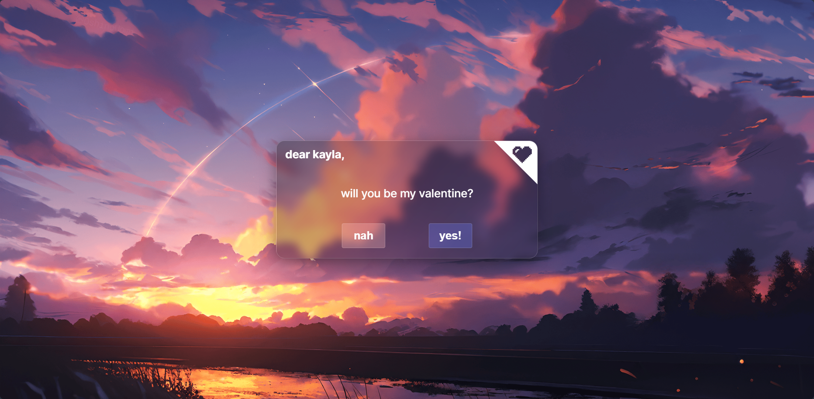

# Valentine Letter

  

(it's simple and ass i know)
 

This is a fun project using only basic HTML, CSS, and JS since I forgot how to use them XD.

It's very simple, but I tried not to make it boring as much as I could. Go check it out!

https://absolutepraya.github.io/valentine-letter/

### Credits

Artworks by [Uomi](https://www.pixiv.net/en/users/11065404)

 

*In next project, I will try to use TailwindCSS and ReactJS to make it more fire.*